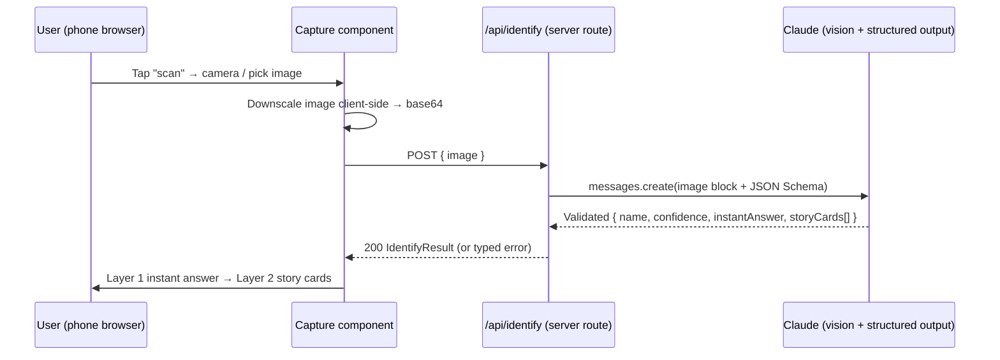

# feat: History Lens — Walking-Skeleton Web Prototype

## Summary

Build the thinnest end-to-end slice of **History Lens**: a user captures or picks an
image in the browser → a Next.js server route sends it to Claude for vision-based
identification → Claude returns a structured, layered "story" (instant answer + a few
swipeable story cards) → the browser renders it. One provider (Anthropic), one screen,
deployed on Vercel. This validates the core "snap → context" loop before any timeline,
kid mode, AR, or media-generation work from the vision doc.

This is a **greenfield** plan: the repo is empty, so there are no local patterns to
mirror — conventions are established here.

---

## Problem Frame

The vision doc (`History_Lens_Product_Vision.md`) describes a full mobile product
spanning camera AI, layered learning, kid mode, explainer media, and AR. None of that
is testable until the core interaction works: *point at a thing → get why it exists.*
This plan builds only that core loop as a web PWA-style prototype so the idea can be
exercised on a real phone (camera works through the mobile browser) and iterated fast.

**In scope:** image capture/upload, one server route calling Claude vision with a
structured story schema, layered result rendering (Layer 1 instant answer + Layer 2
story cards), loading/error states, Vercel deploy.

**Out of scope (this plan):** timeline view, kid-mode toggle, AR overlays, AI
video/audio generation, GPS/local context, saved collections, accounts, monetization,
deep-dive article view (Layer 3). These are carried to *Deferred to Follow-Up Work*.

---

## Requirements

- **R1.** A user can provide an image either by capturing from the device camera or
  selecting a file (mobile browsers expose both via a single file input with `capture`).
- **R2.** The image is sent to a server-side route — the Anthropic API key is never
  exposed to the client.
- **R3.** Claude identifies the primary object and returns a **structured** response:
  object name, a one-sentence instant answer, and 3–5 short story cards
  (what / why / how it changed / a fact / related). Maps to the vision's Layer 1 +
  Layer 2 and the Content Architecture section.
- **R4.** The UI renders the instant answer prominently, then the story cards as
  vertical/swipeable cards (vision §"Layer 2: Story Mode").
- **R5.** Loading and error states are handled (slow network, model refusal, oversized
  image, non-identifiable image).
- **R6.** The app deploys to Vercel and runs end-to-end from a phone browser.

**Success criteria:** point a phone at a stop sign / building / plant → within a few
seconds see a correct name, a one-line summary, and readable story cards.

---

## Key Technical Decisions

- **KTD1 — Stack: Next.js (App Router) + TypeScript, deployed on Vercel.** Server
  route handles the Claude call (Fluid Compute, Node.js runtime). Camera access uses a
  standard `<input type="file" accept="image/*" capture="environment">` — works in
  mobile Safari/Chrome with zero native dependencies. Rationale: fastest path to a
  phone-testable prototype; the Vercel toolchain is already set up in this environment.

- **KTD2 — Single AI provider: Anthropic Claude, vision + structured output in one
  call.** The route sends the image as a base64 `image` content block and constrains
  the response with `output_config.format` (JSON Schema) so the server gets a validated
  object — no brittle text parsing. One model call produces identification *and* story
  together, which is cheaper and simpler than a two-step pipeline for the skeleton.

- **KTD3 — Model: default `claude-opus-4-8`; cost lever documented.** Opus 4.8
  ($5/$25 per 1M tokens) for best vision + story quality. If per-scan cost matters once
  usage grows, `claude-sonnet-4-6` ($3/$15) handles image understanding + short-form
  generation well at ~40% lower cost, and `claude-haiku-4-5` ($1/$5) is the floor.
  The model ID lives in one env/config constant so switching is a one-line change.
  *(See Open Questions — OQ1.)*

- **KTD4 — Structured response shape is the contract between route and UI.** A single
  `IdentifyResult` type (object name, confidence, instant answer, story cards) is the
  JSON Schema sent to Claude *and* the TypeScript type the UI consumes. Defined once,
  imported on both sides.

- **KTD5 — Image sent as base64 in the request body (not the Files API).** For a
  single-shot identify call there's no reuse benefit to uploading first; base64 inline
  is simpler. Downscale client-side before upload to control token cost and latency
  (high-res images cost meaningfully more vision tokens).

---

## High-Level Technical Design

The skeleton is a four-stage data flow: capture → POST → Claude vision+story →
layered render.



*Directional — the prose and per-unit fields are authoritative where they differ.*

---

## Output Structure

```
History-of-Everything/
├── app/
│   ├── api/
│   │   └── identify/
│   │       └── route.ts        # U2 — Claude vision + structured output
│   ├── page.tsx                # U5 — home screen composition + state machine
│   ├── layout.tsx              # U1 — root layout
│   └── globals.css             # U1 — base styles
├── components/
│   ├── Capture.tsx             # U3 — camera/file input + downscale
│   └── StoryResult.tsx         # U4 — layered render (instant answer + cards)
├── lib/
│   ├── claude.ts               # U2 — Anthropic client + model constant
│   └── types.ts                # U2/KTD4 — IdentifyResult schema + TS type
├── .env.local                  # U1 — ANTHROPIC_API_KEY (gitignored)
├── package.json                # U1
└── next.config.ts              # U1
```

*Scope declaration, not a constraint — per-unit `Files` lists are authoritative.*

---

## Implementation Units

### U1. Project scaffold + deploy config

**Goal:** A running Next.js + TypeScript app skeleton that builds locally and deploys
to Vercel, with the Anthropic SDK installed and the API key wired via env.

**Requirements:** R6
**Dependencies:** none
**Files:** `package.json`, `next.config.ts`, `tsconfig.json`, `app/layout.tsx`,
`app/page.tsx` (placeholder), `app/globals.css`, `.env.local`, `.gitignore`,
`.env.example`

**Approach:** Scaffold with the Next.js App Router (TypeScript). Add
`@anthropic-ai/sdk`. Put `ANTHROPIC_API_KEY` in `.env.local` (gitignored) and document
it in `.env.example`; on Vercel it becomes a project env var. Confirm a placeholder
home page renders and `next build` succeeds.

**Patterns to follow:** Standard Next.js App Router defaults — no custom conventions
yet (greenfield).

**Test scenarios:** `Test expectation: none — scaffolding/config only.` Manual gate:
`next dev` serves the placeholder page; `next build` exits 0.

**Verification:** Local dev server renders the placeholder; build passes; a Vercel
preview deploy loads.

---

### U2. Claude identification + story API route

**Goal:** A server route that accepts an image and returns a validated, layered story
object from Claude in one call. This is the heart of the skeleton.

**Requirements:** R2, R3
**Dependencies:** U1
**Files:** `app/api/identify/route.ts`, `lib/claude.ts`, `lib/types.ts`

**Approach:**
- `lib/types.ts` defines `IdentifyResult` and the equivalent JSON Schema (single source
  of truth, per KTD4): `name` (string), `confidence` (number 0–1), `instantAnswer`
  (one sentence), `storyCards` (array of `{ heading, body }`, 3–5 items, headings like
  *What is it? / Why does it exist? / How has it changed? / Interesting fact / Related*).
- `lib/claude.ts` exports a configured Anthropic client and a single `MODEL` constant
  (default `claude-opus-4-8` per KTD3).
- `route.ts` (POST): read base64 image + media type from the request body; call
  `messages.create` with a user message containing an `image` content block
  (`source: { type: "base64", media_type, data }`) plus a text instruction, and
  `output_config: { format: { type: "json_schema", schema } }` so the response is
  schema-constrained. Parse the returned JSON, validate against `IdentifyResult`,
  return 200. Handle `stop_reason === "refusal"` and the not-identifiable case as typed
  errors (see U2 error paths). Set a generous `max_tokens` (~4–8k) since story text is
  short.

**Execution note:** Start with a failing test for the request/response contract
(valid image → `IdentifyResult` shape) before wiring the live Claude call.

**Patterns to follow:** Anthropic SDK vision (`{type:"image", source:{type:"base64",...}}`)
and structured output (`output_config.format` JSON Schema) per the claude-api skill.

**Test scenarios:**
- Happy path: POST a valid base64 image → 200 with `IdentifyResult` whose `storyCards`
  has 3–5 entries and a non-empty `instantAnswer`. (Covers R3.)
- Schema enforcement: response always parses into `IdentifyResult` (mock the Claude
  call to return schema-valid JSON; assert the typed parse succeeds).
- Edge: empty/oversized body → 400 with a typed error, no Claude call made.
- Edge: missing/invalid `media_type` → 400.
- Error path: Claude returns `stop_reason: "refusal"` → route returns a typed
  `refused` error (not a 500), surfaced as a friendly message upstream.
- Error path: Claude/network throws → 502/503 typed error, not an unhandled crash.
- Integration: with a stubbed Claude client, a POST flows through validation → call →
  parse → typed 200 (proves the wiring, not just units).

**Verification:** `curl`-ing a sample image at the route returns a well-formed
`IdentifyResult`; refusal and bad-input cases return typed errors with correct status.

---

### U3. Camera / image capture component

**Goal:** A client component that lets the user capture from the camera or pick a file,
downscales it, and hands base64 + media type to the caller.

**Requirements:** R1
**Dependencies:** U1
**Files:** `components/Capture.tsx`

**Approach:** Client component with `<input type="file" accept="image/*"
capture="environment">` (mobile shows camera + library). On change, draw the image to a
canvas to downscale to a sane max edge (e.g. ~1280px) and re-encode to JPEG base64
(KTD5) to bound token cost. Expose an `onCapture(image)` callback; show a thumbnail
preview and a re-take affordance.

**Patterns to follow:** None yet (greenfield) — keep it a small controlled component.

**Test scenarios:**
- Happy path: selecting an image fires `onCapture` with non-empty base64 and a correct
  `media_type`.
- Edge: downscale logic caps the longest edge at the target and produces valid JPEG
  data (assert on a large fixture image).
- Edge: a non-image file is rejected (no `onCapture` fired).
- Edge: cancelling the picker leaves state unchanged.

**Verification:** On a phone, the control opens the camera; on desktop it opens a file
picker; a chosen image previews and downscaled data is produced.

---

### U4. Layered story result UI

**Goal:** Render an `IdentifyResult` as Layer 1 (instant answer) + Layer 2 (story
cards), readable on a phone.

**Requirements:** R3, R4
**Dependencies:** U2 (consumes `IdentifyResult` type)
**Files:** `components/StoryResult.tsx`

**Approach:** Presentational component taking `IdentifyResult`. Render the object
`name` and `instantAnswer` as a large headline block (Layer 1), then `storyCards` as a
vertical stack / swipeable card list (Layer 2, vision §"Story Mode"). Show `confidence`
subtly (e.g. a low-confidence hint). No data fetching here — pure props in.

**Patterns to follow:** None yet (greenfield); keep presentational and prop-driven.

**Test scenarios:**
- Happy path: given a full `IdentifyResult`, the name, instant answer, and every story
  card render. (Covers R4.)
- Edge: minimum (3) and maximum (5) story cards both render without layout breakage.
- Edge: low `confidence` renders the uncertainty hint; high confidence does not.
- Edge: a card with an empty `body` is skipped or shows a graceful placeholder.

**Verification:** Rendering a sample result shows a clear headline + readable cards on a
narrow viewport.

---

### U5. Home screen composition + state machine

**Goal:** Wire capture → POST `/api/identify` → result/loading/error into the single
home screen, with a reset to scan again.

**Requirements:** R1, R4, R5
**Dependencies:** U2, U3, U4
**Files:** `app/page.tsx`

**Approach:** Client page holding a small state machine:
`idle → capturing → loading → result | error`. On `onCapture` from `Capture` (U3), POST
the image to `/api/identify`, show a loading indicator (vision principle: time-to-answer
< 5s, so show progress immediately), then render `StoryResult` (U4) or a typed error
message. Provide a "scan again" reset back to `idle`. Map U2's typed errors (refused,
bad input, upstream failure) to distinct user-facing messages.

**Patterns to follow:** Consumes U2/U3/U4 contracts; no new conventions.

**Test scenarios:**
- Happy path: capture → loading shown → 200 → `StoryResult` rendered. (Covers R4.)
- Error path: route returns `refused` → friendly "couldn't identify that" message, not
  a crash. (Covers R5.)
- Error path: network failure → retry-able error state.
- Edge: "scan again" returns to `idle` and clears the previous result.
- Integration: full client flow with a mocked `/api/identify` proves capture → fetch →
  render wiring end to end.

**Verification:** On a phone, a full scan produces a story within a few seconds; errors
show readable messages; "scan again" works.

---

## Scope Boundaries

### Deferred to Follow-Up Work
- Layer 3 deep-dive article view (sources, references) — vision §"Layer 3".
- Timeline view and timeline animation.
- Kid-mode toggle and simplified-vocabulary generation.
- AI explainer media: video summaries, audio narration, before/after sliders.
- AR overlays.
- GPS / local-context enrichment ("installed at this intersection in 1988").
- Saved collections, accounts, monetization tiers.
- Installable PWA manifest / offline support (prototype runs as a normal web app first).
- Multi-provider abstraction (deferred per the walking-skeleton scoping).

---

## Risks & Dependencies

- **API key exposure.** Mitigated by KTD2 — all Claude calls are server-side; the key
  lives only in env / Vercel project settings, never shipped to the client.
- **Per-scan cost / latency.** Vision tokens scale with image size; mitigated by
  client-side downscaling (KTD5) and the model cost lever (KTD3 / OQ1).
- **Identification quality on ambiguous inputs.** A blurry or contextless photo may
  yield low confidence; surfaced honestly via `confidence` (U4) rather than hidden.
- **Model refusal on edge inputs.** Handled as a typed error path (U2, U5), not a crash.
- **Dependency:** a valid Anthropic API key with access to the chosen model; Vercel
  project linked for deploy (already set up in this environment).

---

## Open Questions

- **OQ1 (resolve before/early in U2):** Default model is `claude-opus-4-8` for quality.
  If you'd rather optimize per-scan cost from the start, switch the `MODEL` constant to
  `claude-sonnet-4-6` (vision + short story well within range, ~40% cheaper) or
  `claude-haiku-4-5` (cheapest). One-line change; does not affect any other unit.
- **OQ2 (deferred to implementation):** Exact story-card count and heading set — start
  with the vision's five (What / Why / How changed / Fact / Related) and tune by feel.
- **OQ3 (deferred):** Downscale target edge (1280 vs 1568+) — pick by eyeballing
  identification quality vs. token cost on real photos.
